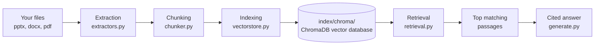
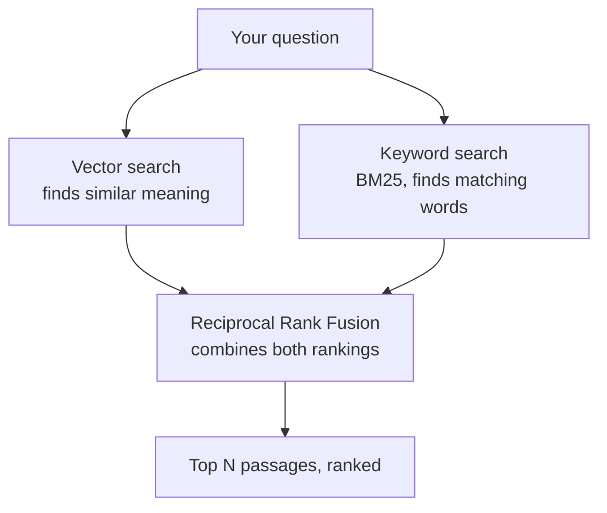
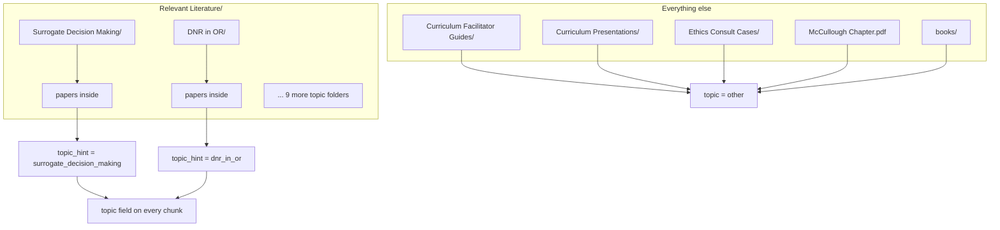

# Ethics RAG — Clinical Ethics Point-of-Care Retrieval

A system that takes a folder of PDFs, PowerPoints, and Word docs about
surgical ethics and turns them into something you can search over in
plain English — "how do I approach a surrogate decision conversation" —
and get back the actual relevant passages, not whole documents — plus a
short answer written from those passages, citing each one by number.

---

## The big picture



In plain English:

1. **Extraction** opens every file and pulls out its text, keeping track
   of where each piece of text came from (which file, which
   slide/page/paragraph).
2. **Chunking** breaks that text into bite-sized pieces — small enough to
   be a focused, scannable passage, not a whole paper.
3. **Indexing** embeds each piece and stores it — text, vector, and
   metadata — in a local ChromaDB vector database (`index/chroma/`). The
   keyword index (BM25) is rebuilt from those same stored texts whenever
   the index is loaded, so Chroma is the single source of truth.
4. **Retrieval** takes a question, searches both indexes, and combines
   the results into a single ranked list of the most relevant passages.

---

## How a search actually works



Two different search methods run side by side:

- **Vector search** understands *meaning* — it would match "talking to a
  family about a poor prognosis" with a passage about "discussing
  prognosis with surrogates," even with no shared words.
- **Keyword search (BM25)** is good at *exact terms* — drug names, legal
  terms, author names, anything where the precise word matters.

Neither is reliable alone, so both run, and their two rankings get merged
(a technique called Reciprocal Rank Fusion) into one final list. A
passage that ranks well in *both* searches comes out on top.

If a `topic` filter is given (see below), that filtering happens **before**
either search runs — so a search for "surrogate decision making" content
never even looks at the futility or informed-consent passages.

---

## Where the `topic` labels come from



Your `Relevant Literature/` folder is organized by topic already (you
built that structure), so `pipeline.py` just reads the subfolder name and
uses it directly as the `topic` tag — no AI model involved, no cost, and
it's exactly as accurate as your own filing.

Full textbooks go in `data/books/` (source_type `textbook`). Their chunks
are labelled with the chapter they came from, taken from each PDF's table of
contents, and their long download filenames are trimmed to "Title
(Authors)". Metadata manifests named `*_sources.json` in `data/` (e.g. the
AMA Journal of Ethics one) supply proper titles, years, and URLs for the
files they list.

Everything else (facilitator guides, slide decks, case files, books) doesn't
have one topic per file — a single facilitator guide might cover five
topics — so those chunks get tagged `other`. They're still fully
searchable by keyword/meaning; they just don't participate in topic
filtering.

---

## Project layout

```
ethics_rag/
├── rag.py               ← the one command you run (build / search / ask / topics)
├── ethics_rag/          ← the code
│   ├── config.py        ← all paths, model names, and tuning knobs
│   ├── extractors.py    ← opens pptx/docx/pdf, pulls out text page/slide/paragraph by paragraph
│   ├── chunker.py       ← breaks text into ~350-word passages with a little overlap
│   ├── pipeline.py      ← walks data/, runs extract -> chunk -> store
│   ├── vectorstore.py   ← stores passages in ChromaDB; rebuilds BM25 keyword index on load
│   ├── retrieval.py     ← hybrid search (vector + keyword, fused with RRF)
│   ├── generate.py      ← asks Groq for a short answer citing passages [1]..[n]
│   └── citations.py     ← "Title (year), "Chapter", PDF pp. 3-4" labels
├── app.py               ← Gradio web app (not used yet)
├── data/                ← your source files (gitignored)
├── index/chroma/        ← the vector database, built from data/ (gitignored)
├── .env                 ← your GROQ_API_KEY (gitignored; copy from .env.example)
└── requirements.txt
```

---

## How to run it

```bash
# one-time setup
python -m venv .venv
source .venv/bin/activate
pip install -r requirements.txt
cp .env.example .env         # then paste your Groq key into .env

# rebuild the vector database from data/ (a few minutes — re-run after adding files)
python rag.py build

# see which passages retrieval finds — no LLM call, free
python rag.py search "how do I approach a surrogate decision conversation"
python rag.py search "suspending DNR orders" --topic dnr_in_or --top-k 8 --chars 1000

# get a short cited answer (calls Groq)
python rag.py ask "how do I approach a surrogate decision conversation"
python rag.py ask "how do I handle a DNR order before surgery" --topic dnr_in_or

# list valid --topic values and how many passages each has
python rag.py topics
```

Topic values are the subfolder names under `Relevant Literature/`,
normalized to lowercase with underscores (e.g. `dnr_in_or`,
`goals_of_care_in_surgery`), plus `other` for everything else.

Citations give **PDF page numbers** — the page as shown in a PDF viewer,
not the printed page number in a book.

---

## Current status

- ✅ Extraction works cleanly across all three formats, including
  two-column academic PDFs
- ✅ Chunking produces consistent ~300-350 word passages
- ✅ Topic filtering works for free via your literature folder structure
- ✅ Books are chapter-labelled from their tables of contents
- ✅ Hybrid (vector + keyword) retrieval over a ChromaDB vector database
- ✅ Short answers from Groq, with numbered citations to page/slide
