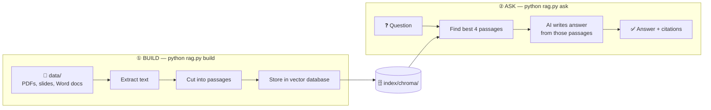
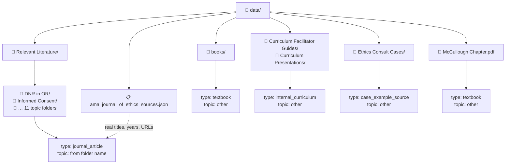
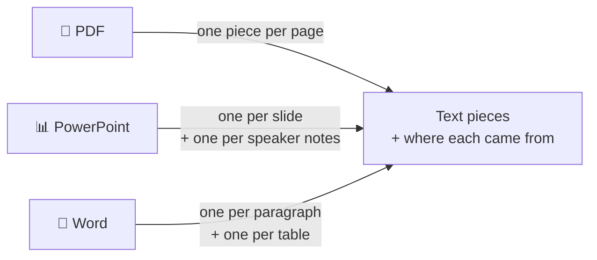
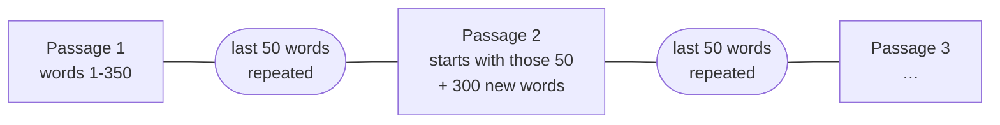
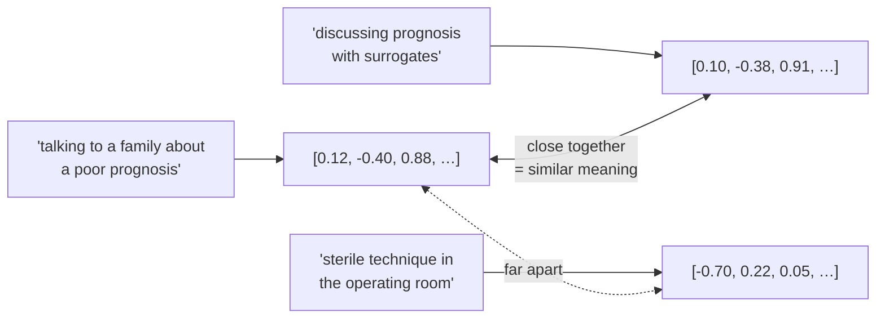
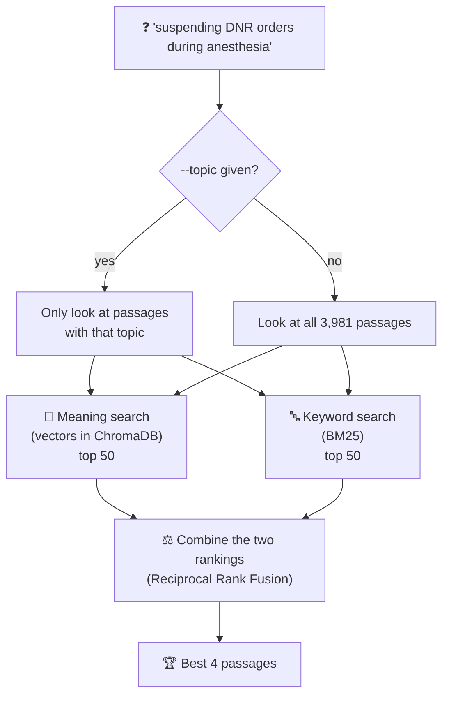
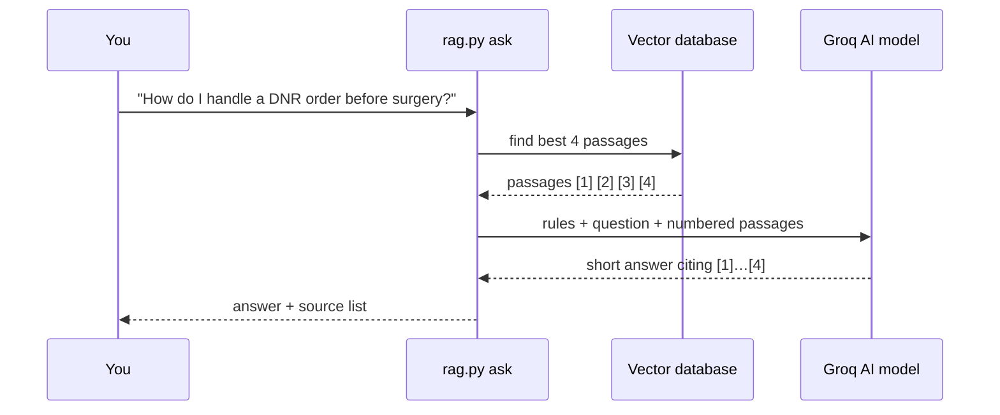
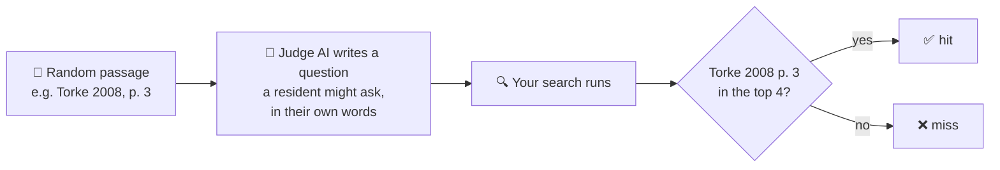

# Ethics RAG — Surgical Ethics Point-of-Care Assistant

Ask a question in plain English, like *"how do I approach a surrogate
decision conversation?"*, and get back:

1. **The most relevant passages** from your library of surgical ethics
   papers, textbooks, and curriculum materials. You get focused paragraphs,
   not whole documents.
2. **A short, practical answer** written *only* from those passages. Each
   claim cites the passage it came from.

```
$ python rag.py ask "how do I approach a surrogate decision conversation"

When you meet a surrogate, start by framing the discussion around the patient's
life story and values rather than trying to predict exact choices [1][3].
Acknowledge that surrogates often feel unprepared ... [2]. If a time-limited
trial is appropriate, outline a clear start-and-end plan ... [4].

Sources:
  [1] Torke 2008 Susbstituted Judgement, PDF p. 3
  [2] How Should Complex Communication Responsibilities Be Distributed in Surgical Education Settings? (2018), PDF p. 3
  [3] Torke 2008 Susbstituted Judgement, PDF pp. 2-3
  [4] Kruser 2023 Time Limited Trial Critical Illness, PDF p. 8
```

"RAG" stands for **Retrieval-Augmented Generation**. The system first
*retrieves* relevant text from your own documents, then *generates* an
answer from that text only, so the AI isn't answering from memory.

---

## Contents

- [The big picture](#the-big-picture)
- [Quick start](#quick-start)
- [Part 1: Your data folder](#part-1-your-data-folder)
- [Part 2: Extraction — getting text out of files](#part-2-extraction--getting-text-out-of-files)
- [Part 3: Chunking — cutting text into passages](#part-3-chunking--cutting-text-into-passages)
- [Part 4: The vector database](#part-4-the-vector-database)
- [Part 5: Retrieval — finding the right passages](#part-5-retrieval--finding-the-right-passages)
- [Part 6: Generation — writing the cited answer](#part-6-generation--writing-the-cited-answer)
- [Part 7: Measuring quality with AI](#part-7-measuring-quality-with-ai)
- [Citations](#citations)
- [Project layout](#project-layout)
- [Settings you can change](#settings-you-can-change)
- [Common tasks](#common-tasks)
- [Troubleshooting](#troubleshooting)
- [Known limitations](#known-limitations)

---

## The big picture

The system has two phases. You run the **build** phase once, and again
whenever you add files. The **question** phase runs every time someone asks
something.



| Step | What happens | Code |
|---|---|---|
| Extract | Open each file and pull out its text, remembering which page or slide it came from | [`extractors.py`](ethics_rag/extractors.py) |
| Chunk | Cut the text into ~350-word passages | [`chunker.py`](ethics_rag/chunker.py) |
| Store | Turn each passage into a vector (a list of numbers that captures its meaning) and save it | [`vectorstore.py`](ethics_rag/vectorstore.py) |
| Retrieve | Find the passages that best match a question | [`retrieval.py`](ethics_rag/retrieval.py) |
| Generate | Ask an AI model to write a short answer that cites those passages | [`generate.py`](ethics_rag/generate.py) |

[`pipeline.py`](ethics_rag/pipeline.py) runs the three build steps in
order, and [`rag.py`](rag.py) is the one command you type.

---

## Quick start

```bash
# one-time setup
python -m venv .venv
source .venv/bin/activate
pip install -r requirements.txt
cp .env.example .env            # then paste your Groq API key into .env

# build the vector database from data/ (takes a few minutes)
python rag.py build

# see which passages are found (free, no AI call)
python rag.py search "how do I approach a surrogate decision conversation"

# get a short cited answer (calls Groq)
python rag.py ask "how do I approach a surrogate decision conversation"

# list the topics you can filter by
python rag.py topics
```

All commands:

| Command | What it does | Options |
|---|---|---|
| `python rag.py build` | Rebuilds the vector database from `data/` | `--data-dir` |
| `python rag.py search "…"` | Shows the matching passages, with no AI call | `--topic`, `--top-k 8`, `--chars 1000` |
| `python rag.py ask "…"` | Returns a short cited answer | `--topic` |
| `python rag.py topics` | Lists topic labels and how many passages each has | |
| `python rag.py eval-questions` | One time: has AI write the test question set | `--n 100` |
| `python rag.py eval` | Scores quality and compares with the last run ([Part 7](#part-7-measuring-quality-with-ai)) | `--answers 30`, `--note "…"` |

Activate the virtual environment first (`source .venv/bin/activate`).

---

## Part 1: Your data folder

The folder a file sits in tells the system **what kind of source** it is
and, for the literature, **what topic** it covers.



### How topics are assigned

Each subfolder of `Relevant Literature/` **is** a topic. The folder name is
converted into a label:

| Folder name | Topic label |
|---|---|
| `DNR in OR` | `dnr_in_or` |
| `Surrogate Decision Making` | `surrogate_decision_making` |
| `Futility (Inappropriate Treatment)` | `futility` *(text in parentheses is dropped)* |
| `Disagreements w Colleagues-Attendings` | `disagreements_with_colleagues_attendings` |

No AI is involved, so the labels are exactly as accurate as your own filing.

Everything outside `Relevant Literature/` gets the topic **`other`**. A
single textbook or facilitator guide covers many topics, so one label per
file would be wrong. These passages still show up in normal searches. They
are only left out when you filter with `--topic`.

### Metadata files

A JSON file named `*_sources.json` in `data/` can supply proper details for
the files it lists: title, year, and source URL. Right now,
`ama_journal_of_ethics_sources.json` gives the 19 AMA Journal of Ethics
articles their real titles instead of filenames like
`perioperative-dnr-suspension-case-2020`.

### What gets included

| Included | Skipped |
|---|---|
| `.pdf`, `.pptx`, `.docx` | Any other file type (e.g. `.lcpdf`, `.DS_Store`) |
| Folders listed in `FOLDER_TO_SOURCE_TYPE` in `pipeline.py` | Unlisted folders (the build prints a warning) |

**Current library:** ~100 files → **3,981 passages**. About 2,500 of them
come from the textbooks, ~1,400 from journal articles, and ~100 from
curriculum and case materials.

---

## Part 2: Extraction — getting text out of files

Each file type is opened differently, but every file ends up in the **same
format**: pieces of text, each tagged with where it came from.



| Format | How text is pulled out | Location recorded |
|---|---|---|
| **PDF** | Page by page, reading text blocks top-to-bottom, left-to-right, which handles two-column papers | PDF page number |
| **PowerPoint** | Slide text and speaker notes, kept separate (the notes usually hold the real explanation) | Slide number |
| **Word** | Paragraph by paragraph. Headings become labels, not text. Tables are kept whole | Paragraph / table number |

### Books get chapter labels

Most book PDFs have a built-in table of contents. The system reads it and
labels every page with its chapter:

```
Ethical Issues in Anesthesiology and Surgery
  └─ "Chapter 4: Perioperative Considerations of Do Not Resuscitate …"
       └─ PDF pages 58-70  →  every passage from here is labelled with that chapter
```

Pages under **Contents**, **Index**, and **Contributors** are skipped, since
they would only add noise to searches. Book filenames like
`Surgical Ethics -- edited by Laurence B_ McCullough … -- Anna's Archive.pdf`
are shortened to `Surgical Ethics (edited by Laurence B. McCullough, …)`.

---

## Part 3: Chunking — cutting text into passages

A 20-page paper is too big to hand to an AI model, and too much for a
resident to read mid-case. So the text is cut into **passages of about 350
words** (roughly a long paragraph or two).



**Why the 50-word overlap?** If an important sentence falls on the
boundary between two passages, the overlap means it still appears whole in
one of them.

Rules the chunker follows:

- A passage **never mixes two files** or **two book chapters**.
- **Slide notes and tables are kept whole**, since they're self-contained.
- **Very long pages** (e.g. a dense two-column PDF page) are first split at
  paragraph breaks, so no passage balloons past the size limit.

---

## Part 4: The vector database

Every passage is stored in a **ChromaDB** vector database, saved on disk in
`index/chroma/`.

### What's a vector?

An **embedding model** reads a passage and turns it into a list of 384
numbers, its *vector*. Passages with **similar meaning** get **similar
vectors**, even when they use different words:



The embedding model is `all-MiniLM-L6-v2`. It runs **on your own
computer**, so it's free and nothing is sent anywhere.

### What's stored for each passage

| Field | Example | Used for |
|---|---|---|
| text | *"The year after the Patient Self-Determination Act passed…"* | Reading, keyword search, the AI's context |
| vector | 384 numbers | Meaning search |
| `source_title` | `Perioperative Do-Not-Resuscitate Orders` | Citations |
| `source_year`, `source_url` | `2015`, `https://journalofethics…` | Citations *(AMA articles only)* |
| `source_type` | `journal_article` / `textbook` / `internal_curriculum` / `case_example_source` | Display |
| `topic` | `dnr_in_or` | `--topic` filter |
| `section_heading` | `Chapter 4: Perioperative Considerations…` | Citations *(books)* |
| `unit_type`, `unit_start`, `unit_end` | `page`, `1`, `2` | Page/slide numbers in citations |
| `source_path` | `data/Relevant Literature/DNR in OR/…pdf` | Finding the original file |

The **keyword index** (see Part 5) isn't saved separately. It's rebuilt
from the stored passages every time the database loads, which takes under
a second. That way there is one source of truth.

**Every build starts fresh.** `python rag.py build` deletes the old
database and rebuilds it from `data/`, so added, removed, and renamed files
are always reflected correctly.

---

## Part 5: Retrieval — finding the right passages

Two different search methods run side by side, because each one catches
things the other misses:



| Method | Good at | Example |
|---|---|---|
| 🧠 **Meaning search** | Same idea, different words | "talking to a family about a poor prognosis" finds "discussing prognosis with surrogates" |
| 🔤 **Keyword search** (BM25) | Exact terms | Drug names, legal terms, author names, "DNR", "Truog" |

### Combining the two rankings

Each search produces its own ranked list. **Reciprocal Rank Fusion (RRF)**
merges them: a passage earns points from each list based on its rank, and
the points add up.

```
points from one list = 1 / (60 + rank)

Passage A: #1 in meaning, #3 in keyword  →  1/61 + 1/63  = 0.0323   🥇
Passage B: #1 in meaning, not in keyword →  1/61          = 0.0164
Passage C: #2 in keyword only            →  1/62          = 0.0161
```

**A passage that does well in both searches wins.** This is the `score`
shown by `python rag.py search`. It only matters for comparing results
*within one search*.

### The topic filter comes first

With `--topic dnr_in_or`, both searches only look at DNR passages.
Filtering happens **before** ranking, not after, so a passage that
merely sounds similar but comes from a different topic can never crowd out
the right one.

---

## Part 6: Generation — writing the cited answer

The 4 best passages are numbered and sent, together with the question, to an
AI model (`openai/gpt-oss-20b`, run by Groq):



### The rules the AI is given

The full instructions are `SYSTEM_PROMPT` in [`generate.py`](ethics_rag/generate.py).
In short:

1. **Use ONLY the passages provided**, never general knowledge.
2. **Keep it short**: 3–6 sentences of practical guidance, not an essay.
3. **Include usable phrases or scripts** when the passages have them.
4. **Cite every key claim** with the passage number, e.g. `[2]`. Never make
   up author names, years, or pages, and never cite a paper's own internal
   reference numbers.
5. **If the passages don't answer the question, say so**, and suggest an
   ethics consult instead of guessing.

The model runs at a low temperature (0.2), which keeps its answers
consistent and close to the text. If the topic filter matches nothing, no
AI call is made at all. You get a "no relevant material found" message.

**Only `ask` sends anything outside your computer.** It sends the question
and the 4 passages to Groq. `build`, `search`, and `topics` run fully
locally.

---

## Part 7: Measuring quality with AI

There are no experts available to grade the system, so AI does the grading
in two ways. Both only check things that **don't need medical expertise**.

### Retrieval: questions with a known answer



The right answer is known because it's the passage the question was
written from. Passages are sampled evenly across topics and source types, so
small topics aren't drowned out by the textbooks. The AI is told to
paraphrase rather than copy the passage's wording, so search can't win just
by matching words.

### Answers: an AI grader checks them against the passages

The system answers a sample of the questions. Then a **larger judge model**
(`gpt-oss-120b`, while answers come from `gpt-oss-20b`) reads each answer
next to the passages it was given and checks every claim:

| Score | What it means | Good value |
|---|---|---|
| **Faithfulness** | % of claims that some passage actually supports. The rest are made up | as close to 100% as possible |
| **Citation accuracy** | % of claims whose own `[n]` points to a passage that supports it | high |
| **Uncited claims** | % of claims with no `[n]` at all | low |
| **Relevance** | 1–5: does the answer address the question? | ~5 |
| **Off-topic refused** | For 10 questions deliberately outside the library (heparin dosing, suture choice…), % where the system says the sources don't cover it | 100% |
| **False refusals** | % of answers that refused even though the right passage *was* found | low |

The judge **does not** decide whether advice is clinically wise. Only an
expert can do that. It only checks that answers stick to your sources.

### Running it

```bash
# one time: have AI write the test set -> eval/questions.jsonl
python rag.py eval-questions

# score retrieval only: free, about a minute
python rag.py eval --note "what I changed"

# also grade 30 answers (~80 Groq calls; ~20 min on the free tier's 8k tokens/min limit)
python rag.py eval --answers 30 --note "what I changed"
```

Each run prints its scores **next to the previous run's**, so you can see
right away whether a change helped:

```
  Source passage found               72.0%   (was 65.0%, +7.0pts)
```

Every question, answer, and verdict is saved to `eval/runs/<date-time>.json`.
These files are kept out of git, because the answers paraphrase copyrighted
sources.

**Keep the same question set.** Scores can only be compared on the same
questions, which is why `eval-questions` refuses to overwrite an existing
set unless you pass `--overwrite`.

### Checking the checker

Once in a while, open a run file and read about 15 of the judge's verdicts
yourself. You don't need medical knowledge for this: read a claim, read the
passage it cites, and ask whether the passage says it. If you mostly agree
with the judge, its scores can be trusted.

Two known quirks:
- Some questions have **more than one good passage**, so a "miss" isn't
  always a real miss. The "source document found" score is more
  forgiving.
- Questions written from **facilitator guides** tend to be teaching
  questions ("how do I run this session?") rather than resident questions.

---

## Citations

Every passage gets a readable label, built by [`citations.py`](ethics_rag/citations.py):

```
Title (Year), "Chapter" [books only], location
```

| Source | Citation |
|---|---|
| Journal article (from AMA manifest) | `Perioperative Do-Not-Resuscitate Orders (2015), PDF pp. 1-2` |
| Journal article (filename title) | `Kalkman 2016 Survival After PeriOp CPR, PDF p. 1` |
| Textbook | `Ethical Issues in Anesthesiology and Surgery (Barbara G. Jericho (eds.)), "Chapter 4: …", PDF pp. 66-67` |
| Slides | `1.0 Introduction, slide 5` |
| Word doc | Title only (paragraph numbers aren't useful to a reader) |

⚠️ **"PDF p." is the page number shown in a PDF viewer**, not the number
printed on a book page. To check a citation, open the PDF and jump to that
page.

---

## Project layout

```
ethics_rag/
├── rag.py                 ← the one command you run
├── ethics_rag/            ← all the code
│   ├── config.py          ← every setting in one place
│   ├── pipeline.py        ← BUILD: walks data/, runs the 3 steps below
│   ├── extractors.py      ←   1. get text out of pdf / pptx / docx
│   ├── chunker.py         ←   2. cut into ~350-word passages
│   ├── vectorstore.py     ←   3. store in ChromaDB (+ rebuild keyword index on load)
│   ├── retrieval.py       ← ASK: hybrid search
│   ├── generate.py        ← ASK: Groq answer with citations
│   ├── evaluation.py      ← EVAL: AI-written test set + AI grader
│   └── citations.py       ← citation labels
├── app.py                 ← web app (Gradio), not in use yet
├── data/                  ← your source files          (not in git)
├── index/chroma/          ← the vector database        (not in git, rebuild anytime)
├── eval/questions.jsonl   ← the test question set
├── eval/runs/             ← scores from every eval run (not in git)
├── .env                   ← your GROQ_API_KEY          (not in git)
├── .env.example           ← template for .env
└── requirements.txt
```

`data/`, `index/`, and `.env` are excluded from git. The data and the key
are private, and the index can always be rebuilt from `data/`.

---

## Settings you can change

All in [`ethics_rag/config.py`](ethics_rag/config.py):

| Setting | Current value | What it controls | Rebuild needed? |
|---|---|---|---|
| `CHUNK_WORDS` | `350` | Passage size | ✅ yes |
| `OVERLAP_WORDS` | `50` | Words repeated between passages | ✅ yes |
| `EMBEDDING_MODEL` | `all-MiniLM-L6-v2` | Meaning-search model | ✅ yes |
| `TOP_K` | `4` | How many passages the AI sees | no |
| `CANDIDATES_PER_RANKER` | `50` | How deep each search looks before combining | no |
| `GROQ_MODEL` | `openai/gpt-oss-20b` | The AI model that writes answers | no |
| `JUDGE_MODEL` | `openai/gpt-oss-120b` | The AI that writes test questions and grades answers | no |

"Rebuild needed" means you must run `python rag.py build` afterwards. For
the embedding model this is essential: questions and passages must be
turned into vectors by the *same* model.

The folder → source type mapping lives in [`pipeline.py`](ethics_rag/pipeline.py)
(`FOLDER_TO_SOURCE_TYPE`), because it describes your data layout rather
than a tuning knob.

---

## Common tasks

**Add new papers on an existing topic:** drop the PDFs into the matching
`data/Relevant Literature/<Topic>/` folder, then run `python rag.py build`.

**Add a new topic:** create a new folder in `data/Relevant Literature/`,
add papers, and run `python rag.py build`. The new label will appear in
`python rag.py topics`.

**Add a new kind of folder** (e.g. `data/Guidelines/`): add it to
`FOLDER_TO_SOURCE_TYPE` in `pipeline.py`, e.g.
`"Guidelines": "society_guideline"`, then rebuild. Unlisted folders are
skipped with a warning.

**Give files proper titles:** add a `something_sources.json` in `data/`
in the same format as `ama_journal_of_ethics_sources.json` (a `documents`
list with `file`, `title`, `year`, `source_url`), then rebuild.

**Check what retrieval finds before trusting an answer:**
`python rag.py search "your question" --chars 1500` shows longer excerpts
of the exact passages the AI would see.

---

## Troubleshooting

| Problem | Cause and fix |
|---|---|
| `401 Invalid API Key` | Check `.env` has `GROQ_API_KEY=gsk_…`. Also check `~/.zshrc` doesn't `export GROQ_API_KEY=…`. A key set in the shell overrides `.env`. Run `unset GROQ_API_KEY` or open a new terminal. |
| `Collection [ethics_chunks] does not exist` | The database hasn't been built. Run `python rag.py build`. |
| `No results for topic '…'` | Topic label misspelled. Check `python rag.py topics`. |
| `Skipping unrecognized folder` during build | Add the folder to `FOLDER_TO_SOURCE_TYPE` in `pipeline.py`. |
| `MuPDF error: format error: No default Layer config` | Harmless warning from one PDF; ignore it. |
| `ModuleNotFoundError: No module named …` | Activate the virtual environment: `source .venv/bin/activate`. |

---

## Known limitations

- **Books are topic `other`.** Their ~2,500 passages are excluded whenever
  you filter by `--topic`, even when a chapter is squarely on that topic.
  They also make up the majority of unfiltered results.
- **Page numbers are PDF pages**, not printed book pages. The PDFs don't
  reliably record printed page numbers.
- **Keyword search splits on spaces only**, so `surrogate,` (with a comma)
  doesn't match `surrogate`. Meaning search compensates for most of this.
- **One book has no table of contents** (*The Ethics of Surgical Practice*),
  so its passages have no chapter labels.
- **DRM-protected files** (`.lcpdf`) can't be read and are skipped.
- **Quality is measured by AI, not experts.** See Part 7. It checks that
  answers stick to the sources, not whether the advice is clinically sound.
- **Copyright.** The textbooks and AMA articles are copyrighted. Keep
  `data/` and `index/` private and don't publish them, e.g. to a public
  web app.
