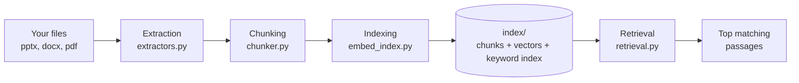
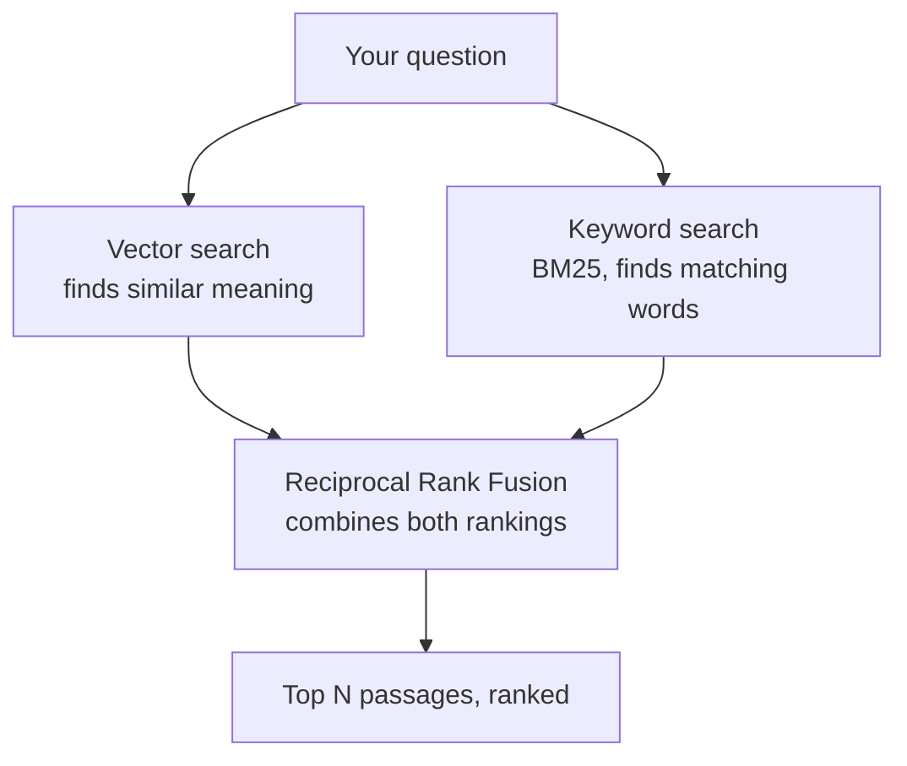
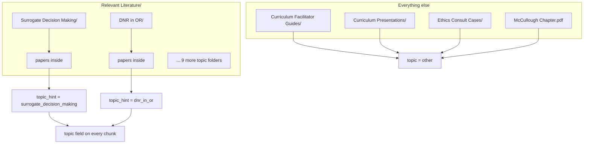

# Ethics RAG — Clinical Ethics Point-of-Care Retrieval

A system that takes a folder of PDFs, PowerPoints, and Word docs about
surgical ethics and turns them into something you can search over in
plain English — "how do I approach a surrogate decision conversation" —
and get back the actual relevant passages, not whole documents.

---

## The big picture



In plain English:

1. **Extraction** opens every file and pulls out its text, keeping track
   of where each piece of text came from (which file, which
   slide/page/paragraph).
2. **Chunking** breaks that text into bite-sized pieces — small enough to
   be a focused, scannable passage, not a whole paper.
3. **Indexing** turns each piece into two searchable forms: a vector
   embedding (for "meaning" search) and a keyword index (for exact-term
   search).
4. **Retrieval** takes a question, searches both indexes, and combines
   the results into a single ranked list of the most relevant passages.

---

## How a search actually works



Two different search methods run side by side:

- **Vector search** understands *meaning* — it would match "talking to a
  family about a poor prognosis" with a passage about "discussing
  prognosis with surrogates," even with no shared words.
- **Keyword search (BM25)** is good at *exact terms* — drug names, legal
  terms, author names, anything where the precise word matters.

Neither is reliable alone, so both run, and their two rankings get merged
(a technique called Reciprocal Rank Fusion) into one final list. A
passage that ranks well in *both* searches comes out on top.

If a `topic` filter is given (see below), that filtering happens **before**
either search runs — so a search for "surrogate decision making" content
never even looks at the futility or informed-consent passages.

---

## Where the `topic` labels come from



Your `Relevant Literature/` folder is organized by topic already (you
built that structure), so `pipeline.py` just reads the subfolder name and
uses it directly as the `topic` tag — no AI model involved, no cost, and
it's exactly as accurate as your own filing.

Everything else (facilitator guides, slide decks, case files) doesn't
have one topic per file — a single facilitator guide might cover five
topics — so those chunks get tagged `other`. They're still fully
searchable by keyword/meaning; they just don't participate in topic
filtering.

---

## What's actually in each file

| File | What it does |
|---|---|
| `extractors.py` | Opens a pptx/docx/pdf and pulls out its text, page by page / slide by slide / paragraph by paragraph, into one common format |
| `chunker.py` | Breaks that text into ~350-word passages with a bit of overlap between consecutive passages, so nothing gets cut off mid-thought |
| `embed_index.py` | Turns every passage into a vector (for meaning search) and builds a keyword index (BM25); saves both to disk |
| `retrieval.py` | Given a question, searches both indexes and returns the best combined matches |
| `pipeline.py` | The one script you actually run — walks your `data/` folder, calls the three steps above in order, and writes the `index/` folder |
| `tagging.py` | **Optional, not used by default.** Uses an LLM (Groq) to guess extra metadata per chunk (legal fact vs. guidance vs. background reading, etc.). Currently skipped — see "What's not built yet" |
| `retag_failed.py` | **Optional, only useful alongside tagging.py.** Re-runs LLM tagging on chunks that failed the first time, without redoing the whole pipeline |

---

## How to run it

```bash
# one-time setup
pip install -r requirements.txt

# rebuild the index from your data/ folder (takes a few seconds)
python pipeline.py --data-dir ./data --index-dir ./index

# ask it something
python retrieval.py "how do I approach a surrogate decision conversation"
```

To filter by topic:

```python
from retrieval import hybrid_search
results = hybrid_search(
    "how do I approach a surrogate decision conversation",
    index_dir="./index",
    topic="surrogate_decision_making",
)
```

Valid topic values are the 11 subfolder names under `Relevant Literature/`,
normalized to lowercase with underscores (e.g. `dnr_in_or`,
`goals_of_care_in_surgery`) — see `TOPIC_TAXONOMY` in `tagging.py` for the
full list, or just check what topics actually exist in your index:

```bash
python3 -c "
import json
from collections import Counter
chunks = [json.loads(l) for l in open('index/chunks.jsonl')]
print(Counter(c.get('topic') for c in chunks))
"
```

---

## Current status

- ✅ Extraction works cleanly across all three formats, including
  two-column academic PDFs
- ✅ Chunking produces consistent ~300-350 word passages (verified: median
  315 words, max 400, zero outliers)
- ✅ Topic filtering works for free via your literature folder structure
- ✅ Hybrid (vector + keyword) retrieval returns relevant, focused
  passages
